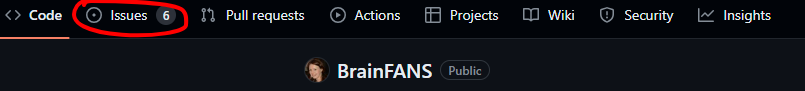
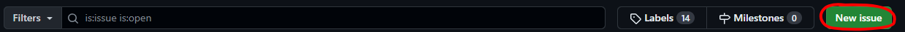
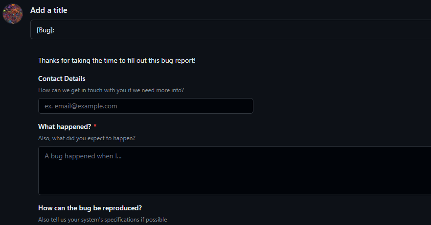
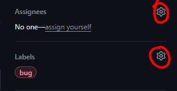
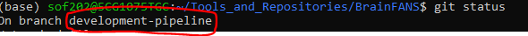
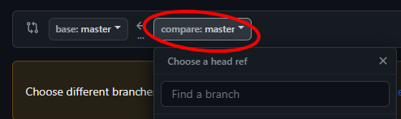
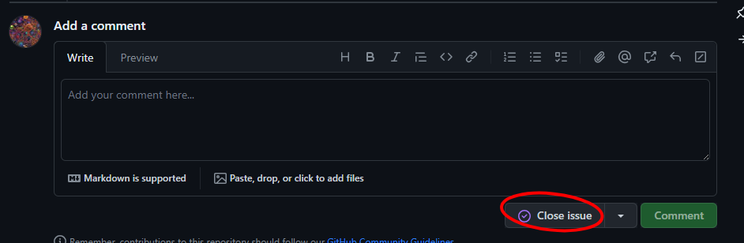

# The Development Pipeline

The following is how to make a change to the BrainFANS repository through the command line (and your favourite text editor). Some text editors like VScode and Sublime Text can elimate the need to remember git commands. We recommend that you use the terminal for your first couple of contributions.

If you are ever unsure about one of the steps lined out in this document, don't hesitate to ask Sam Fletcher <s.o.fletcher@exeter.ac.uk>.

## Contents

1) [**Get the latest version of BrainFANS**](#step-one-get-the-latest-version-of-brainfans)
2) [**Submit an issue**](#step-two-submit-an-issue)
3) [**Create a new branch**](#step-three-create-a-new-branch)
4) [**Resolve the issue**](#step-four-resolve-the-issue)
5) [**Create the pull request**](#step-five-creating-a-pull-request)
6) [**Finalise pull request**](#step-six-finalise-the-pull-request)

## Step One: Get the latest version of BrainFANS

If this is your first contribution, please use the following command to clone the repository to a personal directory of yours:

```console
# Creates a copy/clone of the online repository found on GitHub
git clone https://github.com/ejh243/BrainFANS.git
```

For subsequent contributions, navigate to the location of your personal BrainFANS repository and pull the latest changes:

```console
cd path/to/BrainFANS

# Updates your local BrainFANS to the latest online version
git pull origin master
```

## Step Two: Submit an issue

### Go to the issues tab



### Click submit issue



### Select the relevant template for your report

- Bug: Make a report for any bugs you have encountered in the repository
- Code refactor: Make suggestions for how code can be optimised/improved
- Documentation: Report any faults in the documentation
- Enhancement: Suggest any features that should be added

### Fill in issue report



### Assign relevant tags (if applicable)

Add relevant personnel to assignees section and add further labels if they are relevant.



### Submit the issue report


## Step Three: Create a new branch

Create a new development branch with a name that is relevant to the issue that you are resolving:

```console
# Creates new branch and moves you onto this branch
git checkout -b <your-branch-name>
```

## Step Four: Resolve the issue

### Setup

**THIS IS IMPORTANT**
\
Before making any commits, run `git status` to check you are indeed in your development branch.



If this is not the branch you created in [step three](#step-three-create-a-new-branch), please run the following:

```console
# Switch to the development branch you created in step three
git checkout <your-branch-name>
```

### Making commits

Edit the relevant files in your favourite text editor one at a time.

Once a **small** change has been made use:

```console
# Stage the relevant file to be committed
git add path/to/file

# Commit the changes
git commit -m "Enter your commit message here"
```

To make the above easier for you, get into the habit of using `git status` often (think of it as the git version of `ls`). Using `git status` will show you which files have been changed and the path to said files (which you can copy and paste).

**Important**: There are two good rules of thumb for your commit messages:

1) The message should complete the sentence: "If applied, this commit will [commit-message]"
2) Don't use the word **and**, be succint. Committing small changes will make this easier

Sometimes it makes sense to make changes to multiple files at a time (especially if they share the same issue). Don't commit loads of files at the same time out of laziness however, that defeats the point of version control.

## Step Five: Creating a pull request

Once you have finished resolving the issue, it is time to create a pull request in order to merge your contributions into the main branch of the repository.

*If this feels scary, don't worry. Because you made a separate branch in [step three](#step-three-create-a-new-branch) you are not in danger of messing up the repository.*

### Pull and push

To begin, run these two commands sequentially:

```console
# Pull any changes from the remote repository that may have changed since step one
git pull origin <your-branch-name>

# Push your changes to the remote repository
git push origin <your-branch-name>
```

Using `git pull` and then `git push` might be unecessary in some circumstances. But it is a good habit to get into, especially as more people work on the repository (it will save you time later, trust me).

### Return to github to finalise the pull request

Move to the pull request tab


Click on 'New pull request'


Select 'master' for the base field and [your development branch] for the compare field



Click on 'Create pull request'

### Fill in the pull request template

There will be a default pull request template for you to fill in.

Please:

- Fill in the description with what you have done
- Replace [number] with the number of the issue that the pull request resolves
- Convert `[ ]`to `[x]` for any checkboxes that are relevant to the pull request

### Assign people and labels to the request


### Click 'Create pull request'


## Step Six: Finalise the pull request

### Code review

From here, someone else (assignee) should complete a code review of your changes.

### Merge branches

Once the code review has been completed, the branches can be merged. At this stage, any merge conflicts should be resolved. This is usually a simple case of choosing which lines to keep from each file.

If this proves difficult, add someone else onto the assignee list of the pull request.

### Delete the development branch

The development branch is no longer required, GitHub should prompt the user to delete the branch safely after the merge has been completed.

### Mark related issues as complete

Go back to the issues that were resolved with this pull request and mark them as completed



## Step Seven

There is no step seven, you are done.
