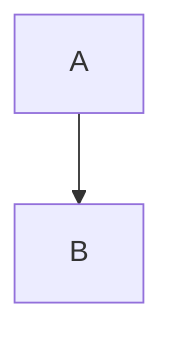

# Docusaurus features

Thanks to mdx and react (javascript framework), the pages on this wiki are more customisable than a regular markdown document. This page provides some of the features that can be added to your pages and links to additional official documentation.


## Admonitions

Considering you are on this page, you have likely seen these special blocks already. Docusaurus enables you to create five different kinds of admonitions: note, info, tip, warning and danger. You can create these admonitions on your pages by using the following syntax:

```markdown
:::info[name of info box]
This is an info box that has **markdown** _capabilites_
:::
```

Which has output:

:::info[name of info box]
This is an info box that has **markdown** _capabilites_
:::

## Mathematics

Docusaurus allows you to use mathematics in a LaTeX format with KaTeX. You can implement mathematical notation into your pages using the $ sign:

```markdown
$E=mc^2$
```

Which will return: $E=mc^2$

### Mathematical blocks

You can use a double $ sign to make mathematical expression have their own box:

```markdown
$$
E=mc^2
$$
```

Which would return:

$$
E=mc^2
$$

## Using tabs

Docusaurus enables you to use tabs to separate out cases. This could be useful if your page needs to describe similar information but in different use cases (for example, how to use a script for different data types, or on different operating systems):

```md
# These import statements can be inserted anywhere in the file
import Tabs from '@theme/Tabs';
import TabItem from '@theme/TabItem';

<Tabs>
  <TabItem value="Mac" label="Mac" default>
    Do xxx for mac
  </TabItem>
  <TabItem value="Linux" label="Linux">
    Do yyy for linux
  </TabItem>
  <TabItem value="Windows" label="Windows">
    Do zzz for windows
  </TabItem>
</Tabs>
```

Which outputs:

import Tabs from '@theme/Tabs';
import TabItem from '@theme/TabItem';

<Tabs>
  <TabItem value="Mac" label="Mac" default>
    Do xxx for mac
  </TabItem>
  <TabItem value="Linux" label="Linux">
    Do yyy for linux
  </TabItem>
  <TabItem value="Windows" label="Windows">
    Do zzz for windows
  </TabItem>
</Tabs>

## Mermaid diagrams

Docusaurus enables the user to make a large number of different diagrams that appear in text. The advantage in this lies with the ability for each develoeper to make a change to the diagram. Embedding images of diagrams works when only one person is working on documentation, but this does not scale well when others need to make changes to such diagrams. Mermaid allows for diagrams to be written in codeblocks:



## Additional features

There are more features available that a developer may find useful. If you want to look into any of these features, head over to the [official docusaurus documentation](https://docusaurus.io/docs/markdown-features).