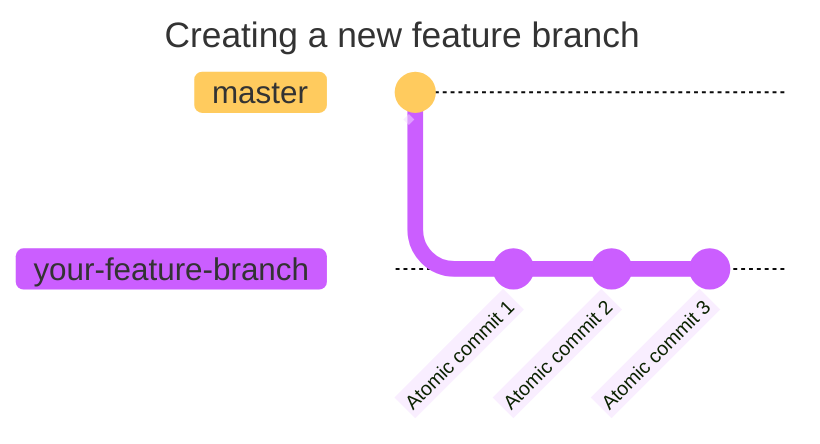
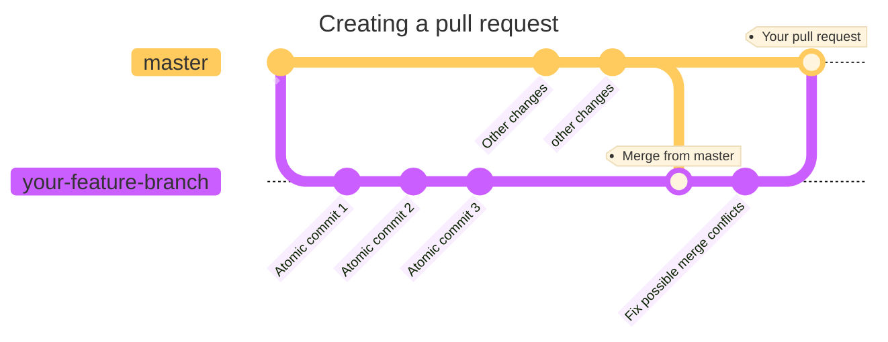

# Overview of our git workflow

Thank you for your interest in contributing to BrainFANS! 

This page covers an overview of the expected git workflow for the BrainFANS
repository. If any steps are confusing (or too brief), please consult the full 
[contributions guide](./_category_.json).

## Choose an issue

Do not work on the repository before assigning yourself (or asking to be 
assigned) to an existing [issue](https://github.com/ejh243/BrainFANS/issues).
Create an issue if none currently apply to what you want to change.

## Update your local repository

Do not work on an outdated version of the repository. Sync your local version
of BrainFANS with `git fetch` regularly to avoid excessive merge conflicts.

## Resolve the issue

Create a new feature branch, either from 'master' or an existing development
branch. Then make your changes there.

:::warning[atomic commits]
Please keep your commits 
['atomic'](https://en.wikipedia.org/wiki/Atomic_commit) if possible. Bugs
introduced in a 200 line changing commit are harder to isolate.
:::

## Create a pull request

Before making a pull request, try to mitigate merge conflicts by merging
the master branch (or development branch) into your feature branch first.

When creating a pull request, please make sure you fill in the template
properly. Give a concise description, link the issue(s) you have resolved and
be honest in the checklist. Assign a reviewer to the pull request if possible,
if not, we will do this for you.

:::warning[Large pull requests]
Please try to keep your pull requests small. Sometimes this is unavoidable, we
understand this. Pull requests that exceed 400 lines of changes are
unlikely to be reviewed unless your reviewer is being particularly nice that
day.
:::

## Finalise pull request

During the review process, you may be asked to make minor changes or to resolve
merge conflicts. Make sure to check how the pull request is coming along and
engage in conversation with the reviewer and other contributors.

After the pull request is approved, you can squash merge your branch into
master (or the development branch). Again, if you are unable to do this, we
will do this for you.

Thank you very much for your time and effort, it is truly appreciated!

If you are reading this, thank you so much for reading our guidelines future
developer! To show that you have read this guide, put a :brain: into your pull
request anywhere by typing `:brain:`.
